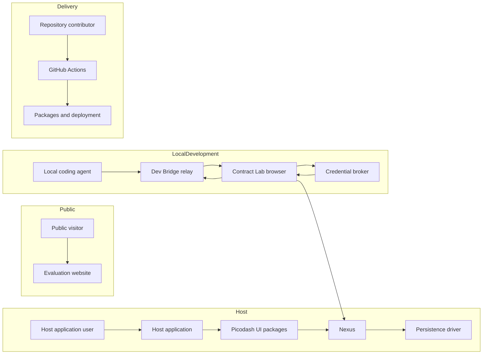

# Picodash threat model

Last reviewed: 2026-08-09

## Executive summary

Picodash is primarily a set of React libraries that runs with the authority of its host application. Its most important security requirement is therefore boundary clarity: Nexus scopes, field bindings, and Dev Bridge disclosure lists must not be treated as application authorization. The repository-owned network surface is the development-only Dev Bridge. It has strong local controls—loopback binding, separate random credentials, origin checks, single-use browser credentials, explicit disclosure and write allowlists, Nexus validation, generation fencing, bounded payloads, and redacted internal errors—but a process running as the same operating-system user can read its credential file and act with the disclosed Bridge authority. The public evaluation website has a small unauthenticated surface and restrictive response headers. No current threat is ranked critical; host authorization mistakes and theft of a Bridge credential protecting sensitive disclosed state are the highest-priority scenarios.

## Scope and assumptions

This model covers the current implementation in `packages/*`, the public evaluation website in `apps/web`, the local Contract Lab and its Dev Bridge host in `apps/lab`, repository scripts, and GitHub Actions under `.github/workflows`. Accepted target contracts are used to explain intended boundaries, but a planned control is not counted as an existing mitigation unless current code or tests implement it. Implementation status is tracked separately in `docs/reference/contract-conformance.md`.

The following assumptions were confirmed for this review:

- `apps/web` is public-facing. `apps/lab` and `@picodash/dev-bridge` are local-development-only.
- Host applications own authentication, authorization, transport security, exposure policy, and decisions about which Panels, Lists, Dashlets, and fields are mounted or disclosed (`docs/reference/picodash.md`, “Status” and “Boundary”).
- Nexus values may contain sensitive host-application data, but Picodash itself is not a multi-tenant service.
- A malicious local process or user is in scope. A process already running as the developer's operating-system account is assumed able to read files owned by that account, including a `0600` credential file; file modes principally exclude other accounts.
- The public website currently has no account, form-processing, or application-data API. Its only public application route is `/` (`apps/web/src/middleware.ts`, `middleware`).

Out of scope are vulnerabilities in a downstream host application except where Picodash's contract could encourage or prevent them; compromise of the operating system, browser, package registry, GitHub, or Vercel control plane; and unimplemented import/export and other future Nexus contracts. These systems still appear as trust boundaries where repository controls depend on them.

Open questions that would change the ranking:

- Will a downstream host expose Picodash controls to users with different privileges or store credentials, personal data, or production secrets in Nexus fields?
- Will Dev Bridge ever be embedded in a non-Lab host, a container shared with untrusted workloads, or a remote development environment?
- What deployment-level controls supplement `apps/web` headers, particularly HTTPS enforcement, HSTS, deployment access control, and logging?

## System model

### Primary components

- **Host application and React UI packages.** `@picodash/ui`, DashPanel, DashList, and the Picodash facade render inside an application and inherit that application's JavaScript authority. DashPanel owns placement, DashList owns control composition, and Picodash composes public package contracts (`AGENTS.md`, “Package and ownership boundaries”).
- **Nexus.** `@picodash/nexus` is the synchronous authority for JSON-compatible values, validation, atomic transactions, scoped metadata, diagnostics, adapters, and optional persistence. Scopes are attribution and organization boundaries, not access-control boundaries (`docs/agents/nexus.md`; `packages/nexus/src/kernel/index.ts`, `setValues`).
- **Persistence driver.** A host-supplied synchronous driver reads and writes serialized envelopes. The Nexus validates envelope shape, identity, schema, authority, values, and metadata and retains pending state on failures or conflicts (`packages/nexus/src/persistence.ts`, `PicodashPersistenceDriver` and `decodePersistenceEnvelope`). The driver and storage confidentiality remain host responsibilities.
- **Public evaluation website.** `apps/web` is a Next.js site with one public application route, no repository-defined account system, and response security headers including CSP, frame denial, MIME sniffing prevention, a referrer policy, and a permissions policy (`apps/web/src/middleware.ts`; `apps/web/next.config.ts`, `headers`).
- **Contract Lab.** `apps/lab` is a loopback development application. Its launcher starts Next.js, the Bridge relay, and a browser-credential broker; it writes the agent credential into the worktree (`apps/lab/scripts/dev-host.mjs`, `createDevHostRuntime`).
- **Dev Bridge.** `@picodash/dev-bridge` connects a local agent to an explicitly disclosed subset of a browser Nexus. The relay exposes bearer-authenticated HTTP for agents and an origin-checked WebSocket for the browser. It delegates writes to public `nexus.setValues` and does not bypass Nexus validation (`packages/dev-bridge/src/relay.ts`, `startPicodashDevBridgeRelay`; `packages/dev-bridge/src/browser.ts`, `execute`).
- **Build and CI.** Bun and Vite+ build and test the packages. GitHub Actions use read-only repository permissions by default, pin actions to full commit hashes, run a high-severity dependency audit, and run CodeQL (`.github/workflows/ci.yml`; `.github/workflows/codeql.yml`). Package publication and Vercel deployment are manual commands in this repository rather than CI workflows (`package.json`, `deploy`; package `prepublishOnly` scripts).

### Data flows and trust boundaries

- **Public visitor → evaluation website:** HTTP(S) requests, paths, and standard headers cross the internet boundary into Next.js. Only `/` is an application route; middleware returns a plain-text 404 for other matched paths. Repository configuration supplies browser security headers, while TLS termination and request-rate controls are deployment responsibilities (`apps/web/src/middleware.ts`; `apps/web/next.config.ts`).
- **Host user or external data → host application → Picodash packages:** application values, component props, actions, and JSX enter Picodash in the host's JavaScript realm. Picodash supplies state and UI contracts, not user authentication or policy authorization. The host must authorize before mounting privileged controls or forwarding data into Nexus (`docs/reference/picodash.md`, “Boundary”).
- **Picodash consumer → Nexus:** field definitions, JSON values, metadata, and transactions cross a library API boundary. Nexus clones strict JSON values, rejects accessors, custom prototypes, symbols, sparse arrays, circular references, and non-finite numbers, and validates a complete candidate before mutation (`packages/nexus/src/json.ts`, `clonePicodashValue`; `docs/agents/nexus.md`, “Implementation constraints”).
- **Nexus ↔ persistence driver:** serialized envelopes and storage notifications cross a host-controlled synchronous driver boundary. Exact envelope keys and identity/schema/authority checks protect integrity; no encryption or cryptographic authenticity is supplied by Nexus (`packages/nexus/src/persistence.ts`, `PicodashPersistenceDriver`, `hasExactKeys`, and `decodePersistenceEnvelope`).
- **Local agent → Dev Bridge relay:** bearer-authenticated HTTP carries session discovery, snapshot reads, allowlisted `set_values`, and bounded waits over loopback. Bodies are capped at 1 MiB while streaming; wait durations are capped at 30 seconds; request schemas use exact keys (`packages/dev-bridge/src/relay.ts`, `http`, `read`, `isSet`, and `isWait`). Traffic is plaintext because it is restricted to loopback.
- **Lab browser → credential broker:** a bodyless POST from the exact Lab origin requests an uncached browser credential over loopback. The broker checks method, path, `Origin`, and bodylessness; the connector also requires a literal `127.0.0.1` URL and omits credentials and referrer (`apps/lab/scripts/dev-host.mjs`, `startBroker`; `apps/lab/src/components/contract-lab/dev-bridge-connector.tsx`, `validUrl`).
- **Lab browser ↔ Dev Bridge relay:** an origin-allowlisted WebSocket uses a fixed subprotocol and a random, origin-bound credential in the first frame. The credential is deleted after first use. Registration declares exact disclosed fields, scopes, diagnostics, and a writable subset; snapshots are checked against that declaration (`packages/dev-bridge/src/relay.ts`, `upgrade`, `validateRegistration`, and `isDisclosureSnapshot`).
- **Dev Bridge browser connector → Nexus:** disclosed snapshots are derived from public Nexus reads. Commands are checked against the writable list in both relay and browser, then passed to `nexus.setValues`. Nexus contract errors are structured and unexpected errors are replaced with a fixed message (`packages/dev-bridge/src/browser.ts`, `makeSnapshot` call and `execute`).
- **Developer workstation → credential files and child processes:** the Lab host creates `.picodash` as `0700`, atomically writes the credential and lock as `0600`, removes only files bearing its instance ID, deletes agent credentials from the browser child's environment, and binds all three servers to `127.0.0.1` (`apps/lab/scripts/dev-host.mjs`, `acquireLock`, `atomicJson`, `cleanup`, and `start`).
- **Repository contributor → CI → build artifacts:** pull-request code and dependency metadata execute in CI. Workflow permissions are read-only except CodeQL's scoped `security-events: write`; actions are commit-pinned and installation uses the frozen lockfile (`.github/workflows/ci.yml`; `.github/workflows/codeql.yml`). A maintainer remains the trust boundary for publishing packages or deploying the website.

#### Diagram

## Assets and security objectives

| Asset                                            | Why it matters                                                                                                 | Security objective (C/I/A) |
| ------------------------------------------------ | -------------------------------------------------------------------------------------------------------------- | -------------------------- |
| Canonical Nexus values                           | Controls, readouts, and host behavior derive from these values; some hosts may place sensitive data in fields. | C/I/A                      |
| Nexus field contracts and validation rules       | A bypass can turn an apparently valid atomic transaction into invalid or dangerous application state.          | I                          |
| Durable scope metadata and persistence envelopes | Corruption can alter layouts, ordering, bindings, or restored values across sessions.                          | C/I/A                      |
| Bridge agent bearer token                        | Possession permits discovery, inspection, writes, and waits within every active session's declared policy.     | C/I                        |
| Single-use browser credentials                   | Possession plus the bound origin permits registering one browser-side session with the relay.                  | C/I                        |
| Disclosure and writable manifests                | These define the maximum Nexus information and mutation authority intentionally exposed to a local agent.      | C/I                        |
| Session identity, generation, and sequence       | These prevent stale commands and observations from being confused with the current browser instance.           | I/A                        |
| Public website content and origin                | Compromise can serve malicious code under the project's trusted public identity.                               | I/A                        |
| Published packages and build artifacts           | Consumers execute package code inside host applications, often with access to their application state.         | I                          |
| CI credentials and security results              | Workflow-token misuse could alter delivery state; suppressed results could hide vulnerable code.               | C/I                        |

## Attacker model

### Capabilities

- An unauthenticated internet user can send arbitrary requests to the deployed evaluation website and can attempt browser-based requests to services on a developer's loopback interface.
- A malicious or compromised dependency executing in the public website, Contract Lab, build, or host application has the privileges of that JavaScript or CI process.
- A malicious local process can scan loopback ports, consume local CPU and memory, and—when running as the developer's OS account—read `.picodash/dev-bridge.json` and use its bearer token.
- A less-privileged local account may attempt to reach loopback services but cannot normally read a `0600` credential inside a `0700` directory.
- A downstream host user may supply values or trigger controls that the host exposes to them. If the host omits policy authorization, that user can exercise the mounted component's application authority.
- A contributor can propose code and dependency changes that execute in pull-request CI, subject to repository review and workflow permissions.

### Non-capabilities

- A remote attacker is not assumed to know either random Bridge credential, read the developer's filesystem, or connect directly to a loopback-only listener from another machine.
- Browser JavaScript from an unrelated origin cannot set the WebSocket `Origin` header to the Lab origin through normal browser APIs, and cross-origin `fetch` cannot read broker responses without a matching CORS origin.
- Nexus scopes do not grant or deny access. An attacker gains no authorization boundary merely by obtaining or guessing a scope ID.
- Picodash is not assumed to isolate mutually untrusted plugins or tenants within one JavaScript realm; arbitrary code in the host realm is already within the host's trust boundary.
- This model does not assume write access to GitHub, the package registry, Vercel, or a host persistence backend unless a threat's prerequisites explicitly state it.

## Entry points and attack surfaces

| Surface                        | How reached                                | Trust boundary                  | Notes                                                                                       | Evidence (repo path / symbol)                                                                    |
| ------------------------------ | ------------------------------------------ | ------------------------------- | ------------------------------------------------------------------------------------------- | ------------------------------------------------------------------------------------------------ |
| Evaluation website `/`         | Public HTTP(S)                             | Internet → Next.js              | One application route; no repository-defined account or data API.                           | `apps/web/src/middleware.ts`, `middleware`                                                       |
| Host component props and JSX   | Host application imports packages          | Host policy → Picodash realm    | Arbitrary UI intentionally runs with host authority; host decides exposure.                 | `packages/picodash/src/picodash-provider.tsx`; `docs/reference/picodash.md`, “Boundary”          |
| Nexus root and scoped APIs     | In-process TypeScript/JavaScript calls     | Consumer → canonical state      | Scope attribution is not authorization; values cross strict JSON and validation boundaries. | `packages/nexus/src/kernel/index.ts`, `RootNexus` and `setValues`; `docs/agents/nexus.md`        |
| Persistence driver             | Host configuration and stored strings      | Nexus ↔ host storage            | Exact decoding and conflict checks exist; storage encryption and access control do not.     | `packages/nexus/src/persistence.ts`, `PicodashPersistenceDriver` and `decodePersistenceEnvelope` |
| Agent REST API                 | Loopback HTTP with bearer token            | Local agent → relay             | Sessions, snapshots, commands, and waits; 1 MiB body cap.                                   | `packages/dev-bridge/src/relay.ts`, `http` and `read`                                            |
| Browser WebSocket              | Loopback WebSocket from allowlisted origin | Lab browser → relay             | Fixed path/subprotocol, exact origin, first-frame single-use token, 1 MiB frame cap.        | `packages/dev-bridge/src/relay.ts`, `upgrade` and `validateRegistration`                         |
| Browser credential broker      | Loopback bodyless POST                     | Lab origin → host broker        | Exact origin, method, path, and no request body; no-store response.                         | `apps/lab/scripts/dev-host.mjs`, `startBroker`                                                   |
| Bridge CLI                     | Local process environment and JSON stdin   | Operator shell → REST client    | Credentials are accepted only through environment variables; JSON bodies enter on stdin.    | `packages/dev-bridge/src/cli.ts`, `main`                                                         |
| Credential and lock files      | Local filesystem                           | Dev host → local processes      | Directory `0700`, files `0600`, atomic replacement, ownership-checked cleanup.              | `apps/lab/scripts/dev-host.mjs`, `acquireLock`, `atomicJson`, and `cleanup`                      |
| GitHub Actions                 | Push or pull request                       | Contributor → CI runner         | Pull-request code builds and tests with read-only contents permission.                      | `.github/workflows/ci.yml`; `.github/workflows/codeql.yml`                                       |
| Manual publish/deploy commands | Maintainer workstation                     | Maintainer → registry or Vercel | No repository workflow automates publication or deployment.                                 | `package.json`, `deploy` and `deploy:prod`; `packages/*/package.json`, `prepublishOnly`          |

## Top abuse paths

1. **Exercise a privileged control through an authorization misconception.** A host treats a Nexus scope or DashList binding as a user boundary → exposes the control to a lower-privileged user → the user calls an allowed UI action → Nexus correctly accepts the value → the host applies an unauthorized operational change.
2. **Steal a local agent credential.** Malicious code runs as the developer's OS account → reads `.picodash/dev-bridge.json` → calls `sessions` and inspects disclosed snapshots → writes every field on a session's writable list → sensitive local state is exposed or changed.
3. **Run development tooling in the wrong environment.** An operator starts Dev Bridge where `NODE_ENV` is not exactly `production` in a shared or production-like environment → a co-resident process obtains or is given the bearer credential → it uses the Bridge as a control channel over live application state.
4. **Exhaust the local relay after authentication.** An attacker obtains the bearer token or executes same-origin Lab code → creates many sessions or distinct pending waits/commands → consumes relay memory, timers, sockets, or browser work → disrupts Contract Lab and agent verification.
5. **Over-disclose diagnostics or scope metadata.** A host registers broad diagnostics or scopes → application-provided diagnostic messages or metadata contain secrets or identifiers → the Bridge serializes those explicitly disclosed records → an agent-token holder retrieves them.
6. **Replace persisted state within the host's storage boundary.** An attacker gains write access to the configured persistence backend → supplies a syntactically and structurally valid envelope matching Nexus identity and schema → values still pass application validation but encode attacker-chosen permissible state → the application restores the state because envelopes are not cryptographically authenticated.
7. **Turn a future website injection into origin compromise.** A later feature reflects attacker-controlled markup or script → the production CSP permits inline scripts → injected code executes under the Picodash website origin → public content integrity and visitor trust are compromised, despite the current site having no such input surface.
8. **Introduce malicious delivery code.** A dependency or contributor change reaches CI → static analysis, tests, or review fail to detect malicious behavior → a maintainer publishes the package or deploys the website → consumers execute the code in trusted host applications.

## Threat model table

| Threat ID | Threat source                                                     | Prerequisites                                                                                                                                                                                    | Threat action                                                                                                        | Impact                                                                                                                                                 | Impacted assets                                                   | Existing controls (evidence)                                                                                                                                                                                                                                                                                                                                   | Gaps                                                                                                                                                                                                                           | Recommended mitigations                                                                                                                                                                                                                                                                                                            | Detection ideas                                                                                                                                                                                                       | Likelihood                                                                                   | Impact severity                                                                                        | Priority   |
| --------- | ----------------------------------------------------------------- | ------------------------------------------------------------------------------------------------------------------------------------------------------------------------------------------------ | -------------------------------------------------------------------------------------------------------------------- | ------------------------------------------------------------------------------------------------------------------------------------------------------ | ----------------------------------------------------------------- | -------------------------------------------------------------------------------------------------------------------------------------------------------------------------------------------------------------------------------------------------------------------------------------------------------------------------------------------------------------- | ------------------------------------------------------------------------------------------------------------------------------------------------------------------------------------------------------------------------------ | ---------------------------------------------------------------------------------------------------------------------------------------------------------------------------------------------------------------------------------------------------------------------------------------------------------------------------------- | --------------------------------------------------------------------------------------------------------------------------------------------------------------------------------------------------------------------- | -------------------------------------------------------------------------------------------- | ------------------------------------------------------------------------------------------------------ | ---------- |
| TM-001    | Lower-privileged host user or compromised host UI                 | A host exposes a privileged control or Nexus operation without enforcing its own authorization, or mistakes scope/disclosure for policy authorization.                                           | Invoke a mounted control or scoped Nexus write that is valid under field rules but forbidden by application policy.  | Unauthorized host action or disclosure with the same consequence as the host's underlying operation.                                                   | Canonical values; host resources and data                         | Contracts explicitly assign authorization and exposure policy to the application and state that scopes do not restrict fields (`docs/reference/picodash.md`, “Boundary”; `docs/agents/nexus.md`). Nexus validates complete transactions.                                                                                                                       | No runtime authorization hook can compensate for a host that mounts the wrong control. Disclosure/write lists are capability bounds for Bridge, not user policy.                                                               | Add a security section to integration docs with a privileged-control example; require hosts to authorize before rendering controls and again at consequential transport/server boundaries; add a review checklist stating that scope IDs and bindings are not ACLs.                                                                | In host apps, audit denied server operations and record user identity, action, and field/control ID; alert on repeated policy denials.                                                                                | Medium: the boundary is documented, but scope-like APIs are commonly mistaken for isolation. | High when controls affect production systems or sensitive values.                                      | **High**   |
| TM-002    | Malicious local process or user                                   | The Bridge is running and the attacker can read the credential file, inherit the token, or compromise an authorized CLI process. Same-OS-user malware satisfies this prerequisite.               | Authenticate to REST, enumerate sessions, read disclosed values/metadata/diagnostics, and modify writable fields.    | Confidentiality and integrity loss limited to active sessions' explicit manifests; Nexus validation still applies.                                     | Agent bearer token; disclosed Nexus state; writable Nexus values  | A 256-bit random bearer token, loopback binding, `0700` directory, `0600` file, removal from browser child env, explicit disclosure/write checks, and Nexus validation (`packages/dev-bridge/src/relay.ts`, `token`, `http`, and `dispatch`; `apps/lab/scripts/dev-host.mjs`, `start`).                                                                        | File modes do not protect against processes running as the same user. There is no agent-token expiry, rotation during a host lifetime, per-client identity, or audit trail.                                                    | Keep disclosed and writable manifests minimal; never disclose secrets by default; add token creation/use/denial audit events with values redacted; consider rotating the agent token and invalidating sessions after configurable idle time if non-Lab consumers appear. Do not claim same-user isolation.                         | Log credential-file permission drift, successful client connection metadata without tokens, session reads/writes, denied fields, and token rotation; alert on unexpected clients or write bursts.                     | Medium for a compromised development account; low for a remote-only attacker.                | High if a host discloses production credentials or consequential writable fields; otherwise medium.    | **High**   |
| TM-003    | Operator error or co-resident workload                            | Dev Bridge is started outside the intended local Lab, `NODE_ENV` is unset/mis-set rather than exactly `production`, and another workload can access its credential or invoke the embedding host. | Use development inspection as an unintended runtime management interface.                                            | Live application state inspection or modification within the configured manifest; expansion pressure could make this worse.                            | Nexus state; Bridge credentials; application integrity            | Relay refuses exact `NODE_ENV=production`, binds `127.0.0.1`, and the package documentation declares development-only use (`packages/dev-bridge/src/relay.ts`, `startPicodashDevBridgeRelay`; `packages/dev-bridge/README.md`, “Development boundary”). Dangerous import/reset/persistence operations are deferred.                                            | Fail-open environment classification: every value other than `production` is allowed. Loopback is reachable by co-resident processes and potentially by SSRF in the same network namespace.                                    | Require an explicit development enable flag in addition to refusing production; keep the package out of production dependency graphs/builds; add a production artifact test that searches for Bridge server imports and public credential URLs; require a new security review before adding dangerous operations or remote access. | Emit a clear startup security event with environment, bind address, and enabled capabilities but no credential; alert or fail deployment if the Bridge package/server appears in a production bundle or process list. | Low under the confirmed deployment model.                                                    | High if attached to production-like Nexus values.                                                      | **Medium** |
| TM-004    | Authenticated local attacker or compromised Lab-origin script     | The attacker possesses the agent token or can execute script at the exact Lab origin and obtain browser credentials.                                                                             | Open many sessions, send large allowed frames repeatedly, or create many distinct pending waits/commands.            | Local memory, CPU, socket, timer, or browser exhaustion; degraded development availability.                                                            | Dev Bridge and Contract Lab availability                          | Loopback binding, authentication, 1 MiB HTTP and WebSocket limits, 30-second wait cap, 5-second command timeout, one-second registration timeout, and a 128-entry tombstone cap (`packages/dev-bridge/src/relay.ts`, relay initialization, `wait`, `read`, and `disconnect`).                                                                                  | No explicit rate limit, global session cap, per-session pending-request cap, credential issuance limit, or aggregate memory budget.                                                                                            | Cap active sessions and pending requests globally/per session; reject excess requests with a stable error; rate-limit browser-credential issuance and authenticated REST calls; add socket idle timeouts and tests for resource cleanup under floods.                                                                              | Track active sockets, active sessions, pending requests, body-limit rejections, wait duration, and event-loop delay; alert on threshold crossings.                                                                    | Medium after credential or same-origin compromise; low otherwise.                            | Medium because impact is local development disruption.                                                 | **Medium** |
| TM-005    | Host integrator or compromised application code                   | The host includes sensitive content in disclosed fields, scope metadata, or diagnostic messages.                                                                                                 | Register an overbroad disclosure and retrieve the resulting snapshot with the agent credential.                      | Sensitive development or host information becomes available to every bearer-token holder and may enter agent output or logs.                           | Nexus values; metadata; diagnostics                               | Disclosure is explicit; writable fields must be a disclosed subset; relay validates exact snapshot coverage; hidden state does not advance disclosed sequences (`packages/dev-bridge/src/serialization.ts`, `validateDisclosure` and `makeSnapshot`; `packages/dev-bridge/src/relay.ts`, `isDisclosureSnapshot`). CLI and connector errors redact credentials. | Diagnostics and metadata are serialized as supplied after JSON filtering; there is no sensitivity classification or field-level redaction within an explicitly disclosed item.                                                 | Document “disclose identifiers and operational summaries, not secrets”; default diagnostics disclosure to false in reusable examples; add optional host-owned diagnostic redaction before registration; keep agents from persisting raw snapshots by default.                                                                      | Audit disclosure manifests at registration; flag names suggesting tokens, passwords, cookies, or keys; log only manifest names, not values.                                                                           | Medium because broad diagnostic disclosure is convenient during debugging.                   | Medium, or high if secrets enter Nexus diagnostics/metadata.                                           | **Medium** |
| TM-006    | Attacker with host persistence-backend write access               | The host uses Nexus-owned persistence and the attacker can modify the configured storage record while preserving a matching identity/schema or can control a custom driver.                      | Supply valid but attacker-chosen persisted values or repeatedly create conflicts/failures.                           | Persistent state manipulation or denial of restoration; impact is constrained by field validation but not by user authorization.                       | Persistence envelopes; canonical values; application availability | Exact-key strict decoding, Nexus/schema/authority checks, complete candidate validation, revision/writer conflict detection, verified writes, and retained pending envelopes (`packages/nexus/src/persistence.ts`, `decodePersistenceEnvelope`, `PicodashPersistenceState`, and write verification).                                                           | Envelopes have no MAC/signature and no encryption. The host-supplied driver is trusted code. Valid but unauthorized values cannot be distinguished from legitimate values.                                                     | State clearly that persistence is not a security boundary; require host storage ACLs and encryption for sensitive data; use an authenticated wrapper driver when tamper evidence is needed; treat validation as integrity-of-shape/domain, not authorization.                                                                      | Surface persistence conflicts/failures through host telemetry; record revisions and writer IDs without values; alert on unexpected writer changes or repeated restore recovery.                                       | Low without backend access; medium in hosts using attacker-writable browser storage.         | Medium to high depending on whether persisted fields drive consequential operations.                   | **Medium** |
| TM-007    | Web attacker exploiting a future injection bug                    | A future public route or component reflects or evaluates attacker-controlled content. The current site has no discovered input that meets this prerequisite.                                     | Execute script under the public website origin; production `script-src` includes `'unsafe-inline'`.                  | Defacement, malicious navigation, or abuse of future same-origin APIs. There are currently no user accounts or sensitive site APIs in this repository. | Website content, origin integrity, visitor trust                  | Single public route, no current data-entry API, `default-src 'self'`, no object embedding, `frame-ancestors 'none'`, and restricted connect/form policies (`apps/web/src/middleware.ts`; `apps/web/next.config.ts`, `headers`). React escapes ordinary text rendering.                                                                                         | CSP lacks nonces or hashes and permits inline scripts and inline styles. HSTS and deployment-layer controls are not recorded here.                                                                                             | Before adding user-controlled content, adopt nonce- or hash-based production scripts if supported by the active Next.js version; add explicit output encoding/sanitization at any HTML/MDX boundary; document and test deployment headers including HSTS.                                                                          | Collect CSP violation reports after deploying a report-only policy; monitor unexpected route creation, script sources, and content changes.                                                                           | Low for the current static route.                                                            | Medium because the site has no sensitive session, but origin compromise harms users and project trust. | **Low**    |
| TM-008    | Malicious dependency, contributor, or compromised maintainer tool | Malicious code passes review/tests, or a maintainer publishes/deploys from a compromised workstation.                                                                                            | Insert code that exfiltrates host values or alters UI behavior, then distribute it as a package or website artifact. | Supply-chain compromise across consuming host applications.                                                                                            | Published packages; website deployment; consumer Nexus data       | Frozen lockfile installation, high-severity dependency audit, CodeQL, package release checks, commit-pinned Actions, minimal workflow permissions, CODEOWNERS, and manual publication (`.github/workflows/ci.yml`; `.github/workflows/codeql.yml`; `.github/CODEOWNERS`).                                                                                      | `bun audit` and CodeQL do not detect all malicious behavior. No repository workflow provides provenance, signed publishing, or reproducible artifact comparison. Manual credentials depend on maintainer workstation security. | Use registry trusted publishing with short-lived identity when release automation is introduced; generate provenance/SBOMs; protect release environments with approval; verify published tarball contents against package artifact tests; review dependency install scripts and lockfile changes.                                  | Alert on package ownership/version changes, unexpected publish times, dependency graph changes, and deployment identities; retain build provenance and artifact hashes.                                               | Low given the small maintainer boundary and existing CI, but non-zero.                       | High because package code runs inside consumer applications.                                           | **Medium** |

The assumptions most affecting priority are that Bridge remains loopback-only and development-only, the public site remains unauthenticated and input-free, and downstream hosts do not place production secrets or high-impact controls in broadly disclosed Nexus fields. TM-002 and TM-003 become high or critical if any of those assumptions changes. TM-001 becomes critical when a mounted control can perform an irreversible high-impact operation without a server-side authorization check.

## Criticality calibration

For this repository, priority reflects realistic exposure after current controls, not only theoretical impact.

- **Critical:** an immediately exploitable path with broad or irreversible impact and little effective mitigation. Examples: unauthenticated remote code execution through the public website; a Bridge listener exposed beyond loopback without authentication and attached to production state; or malicious published package code that reliably exfiltrates consumer secrets at scale.
- **High:** a credible path to sensitive state or consequential host actions that needs one meaningful prerequisite. Examples: a host using Nexus scopes as ACLs for production controls; theft of a live Bridge token that exposes secrets and writable operational fields; or bypass of Nexus's complete-candidate validation that permits partial invalid mutation.
- **Medium:** a bounded compromise, local denial of service, or high-impact scenario with unlikely prerequisites. Examples: authenticated exhaustion of a local relay; accidental Bridge enablement in a production-like container while it remains token-protected; tampering with a host-writable persistence backend; or a supply-chain change that must also evade review and manual release controls.
- **Low:** limited disclosure or integrity impact with strong prerequisites or easy recovery. Examples: route enumeration against the one-page public site; failure to fence a stale Bridge generation when the result is only a rejected development action; or a future website injection whose current prerequisite—attacker-controlled renderable content—does not exist.

## Focus paths for security review

| Path                                                            | Why it matters                                                                                                                  | Related Threat IDs             |
| --------------------------------------------------------------- | ------------------------------------------------------------------------------------------------------------------------------- | ------------------------------ |
| `packages/dev-bridge/src/relay.ts`                              | Owns both network listeners, credentials, origin checks, schemas, limits, session fencing, and authorization of Bridge actions. | TM-002, TM-003, TM-004, TM-005 |
| `packages/dev-bridge/src/browser.ts`                            | Converts relay commands into public Nexus writes and controls browser-side error disclosure and sequence publication.           | TM-002, TM-004, TM-005         |
| `packages/dev-bridge/src/serialization.ts`                      | Defines exactly which values, metadata, and diagnostics cross the disclosure boundary and when sequences change.                | TM-005                         |
| `packages/dev-bridge/src/client.ts`                             | Handles bearer-token transport and protocol responses for agent callers.                                                        | TM-002, TM-004                 |
| `packages/dev-bridge/src/cli.ts`                                | Reads credentials from the process environment and parses operator-controlled JSON stdin.                                       | TM-002, TM-004                 |
| `apps/lab/scripts/dev-host.mjs`                                 | Creates and cleans credential files, issues browser credentials, binds services, and controls the browser child's environment.  | TM-002, TM-003, TM-004         |
| `apps/lab/src/components/contract-lab/dev-bridge-connector.tsx` | Declares the concrete Lab disclosure/write manifest and fetches the browser credential.                                         | TM-005                         |
| `packages/nexus/src/kernel/index.ts`                            | Owns field contracts, complete-candidate validation, atomic mutation, scopes, and lifecycle enforcement.                        | TM-001, TM-002, TM-006         |
| `packages/nexus/src/json.ts`                                    | Enforces strict JSON cloning against prototype, accessor, sparse-array, cycle, and non-finite-value hazards.                    | TM-001, TM-006                 |
| `packages/nexus/src/persistence.ts`                             | Decodes untrusted stored strings, detects conflicts, and delegates to host-controlled drivers.                                  | TM-006                         |
| `packages/nexus/src/adapter.ts`                                 | Defines the boundary with existing application state authorities and their callbacks.                                           | TM-001, TM-006                 |
| `apps/web/src/middleware.ts`                                    | Defines the public route boundary and default response for unknown application paths.                                           | TM-007                         |
| `apps/web/next.config.ts`                                       | Defines CSP and other browser security headers for the public origin.                                                           | TM-007                         |
| `.github/workflows/ci.yml`                                      | Executes contributor code and dependencies and sets the default CI permission and verification posture.                         | TM-008                         |
| `.github/workflows/codeql.yml`                                  | Holds the only elevated workflow permission and the static-analysis configuration.                                              | TM-008                         |
| `packages/*/package.json`                                       | Defines publishable files, entrypoints, scripts, and prepublication checks for consumer artifacts.                              | TM-008                         |

## Quality check

- [x] Covered the public website, host library APIs, Nexus persistence, Dev Bridge HTTP/WebSocket/broker/CLI/file surfaces, and CI/delivery entry points discovered in the repository.
- [x] Represented every identified trust boundary in at least one threat or abuse path.
- [x] Separated production libraries and website behavior from local development tooling and from build/CI behavior.
- [x] Reflected the confirmed deployment, sensitivity, tenancy, implementation-status, and malicious-local-process assumptions.
- [x] Distinguished implemented controls from accepted or recommended future controls.
- [x] Kept downstream host authorization and storage security explicit rather than attributing them to Picodash.
